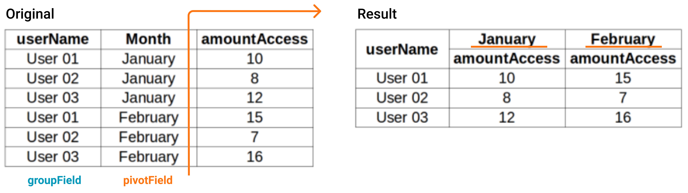

<div style="text-align: center">

# pivot-data
**Um jeito fácil de organizar dados de uma matriz para tabelas dinâmicas e outras aplicações.**

<a href="#descrição">Descrição</a>&nbsp;&nbsp;&nbsp;|&nbsp;&nbsp;&nbsp;
<a href="#instalação">Instalação</a>&nbsp;&nbsp;&nbsp;|&nbsp;&nbsp;&nbsp;
<a href="#modo-de-uso">Modo de uso</a>&nbsp;&nbsp;&nbsp;|&nbsp;&nbsp;&nbsp;
<a href="#licença">Licença</a>

</div>

___

## Descrição

Pivot-data é um lib criada para converter os dados de uma matriz de modo à ser usada em uma tabela dinâmica ou *pivot table*, além deste recurso você pode usar esse projeto para agrupar os dados de uma matriz de acordo com um ou mais campos chaves e converter uma matriz de dados em objeto.

### O que não está previsto ?

Essa lib não realiza qualquer alteração visual no layout da página, ela não converte tabelas HTML em tabelas dinâmicas, a mesma converte apenas a estrutura de dados que pode ser usada para imprimir tabelas dinâmicas.

## Instalação

(Aguardando publicação em NPM)

Use este projeto com o jsDelivr, para isso inclua uma das duas urls abaixo em seu website: \
pivotData.js: https://cdn.jsdelivr.net/gh/mauricio-andre/pivot-data/dist/pivotData.js \
pivotData.min.js: https://cdn.jsdelivr.net/gh/mauricio-andre/pivot-data/dist/pivotData.min.js

Consultes os arquivos compilados na pasta [dist]('./dist') ou baixe os mesmos em formato [zip]('./.github/pivotData.zip').

## Modo de uso

Observe o array de dados 'data' no exemplo abaixo, o objetivo é transformar essa estrutura em um *pivot table*, para isso basta executar a função **pivotData** passando como parâmetro o array de dados atual e a configuração desejado.
``` javascript
const data = [
  { userName: 'User 01', month: 'January', amountAccess: 10 },
  { userName: 'User 02', month: 'January', amountAccess: 8 },
  { userName: 'User 03', month: 'January', amountAccess: 12 },
  { userName: 'User 01', month: 'February', amountAccess: 15 },
  { userName: 'User 02', month: 'February', amountAccess: 7 },
  { userName: 'User 03', month: 'February', amountAccess: 16 },
]

const result = pivotData(data, {
  groupField: 'userName',
  pivotField: 'month',
});

/**
 * Array com o resultado da conversão de dados
 * result.data: [
 *    [ 'User 01', 10, 15 ],
 *    [ 'User 02', 8, 7 ],
 *    [ 'User 03', 12, 16 ],
 * ]
 *
 * Mapa com os índices das linhas para cada grupo de dados
 * result.lineMap: {
 *    'User 01': 0
 *    'User 02': 1
 *    'User 03': 2
 * }
 *
 * Mapa com o índice das novas colunas no array
 * result.columnMao: {
 *    userName: 0,
 *    January_amountAccess: 1,
 *    February_amountAccess: 2,
 * }
 *
 * Mapa com a estrutura de colunas resultante
 * result.map: [
 *    [ 'userName' ],
 *    [ 'January', 'February' ],
 *    [ 'amountAccess' ]
 * ]
 */

const resultObj = pivotData(data, {
  groupField: 'userName',
  pivotField: 'month',
  linearData: false,
});

/**
 * Resultado da conversão de dados retornado como estrutura de objeto
 * resultObj.data: [
 *  'User 01': {
 *    January: [ { amountAccess: 10 } ],
 *    February: [ { amountAccess: 15 } ],
 *  },
 *  'User 02': {
 *    January: [ { amountAccess: 8 } ],
 *    February: [ { amountAccess: 7 } ],
 *  },
 *  'User 03': {
 *    January: [ { amountAccess: 12 } ],
 *    February: [ { amountAccess: 16 } ],
 *  },
 * ]
 */
```

A imagem seguinte é uma representação visual do resultado da função executada.
<div style="text-align: center; margin-bottom: 20px;">

</div>

### Parâmetros

A tabela a seguir apresenta a lista de parâmetros disponíveis para a função.


|        Nome       |      Tipo       | Obrigatório | Descrição |
|:------------------|:---------------:|:-----------:|:----------|
|        data       | [Object\|array] |     Sim     | Array de objetos ou de outros arrays com os dados a serem convertidos |
|       params      |      Object     |     Sim     | Objeto que contém as parametrizações e regras de conversão |
| params.groupField | string\|number\|[string\|number] |     Sim     | Nome da propriedade ou índice do array que deve ser usado como base para agrupar os dados, pode ser informado como array |
|  params.keyPrefix |      string     |     Não     | Prefixo a ser concatenado com a chave do objeto de dados resultante |
| params.linearData |     boolean     |     Não     | Define do formato de dados de saída, *true* para array e *false* para Objeto. Valor padrão é *true* |
| params.pivotField |      string     |     Não     | Coluna para ser usada como *pivot*, quando nulo faz com que os dados apenas sejam agrupados |

<br>

### Retorno

O objeto retornado pela função **pivotData** possui quatro propriedades, estas estão descritas abaixo.

**data**: Novo conjunto de dados resultante da conversão, quando 'linearData' é verdadeiro seu resultado é um array, quando falso seu resultado é um objeto.\
**lineMap**: Objeto que representa um mapa com a localização dos registros no novo conjunto de dados, útil quando a entrada de dados é um array de objetos e a saída é um array. O nome da propriedade é o valor da coluna informada em 'groupField' (quando mais de uma coluna é informada em groupField, os valores são concatenados com underlines), seu valor é o índice em que o registro se localiza no array de dados resultante.\
**columnMap**: Objeto que representa um mapa com os indices das colunas retornadas no novo array de dados, essa propriedade está disponível somente quando 'linearData' é verdadeiro e 'pivotField' é informado. O nome das propriedades são as colunas informadas em 'groupField' seguidas pela concatenação dos valores existentes para a coluna informada em 'pivotField' e as colunas restantes do array de dados original, seu valor é o índice da coluna no novo array de dados resultante.\
**map**: Array que contem um mapa das novas colunas do array de dados, esse array contem outros três arrays que representam respectivamente, uma cópia dos campos informados em 'groupField', a lista dos diferentes valores encontrados para a coluna informada em 'pivotField' (quando pivotField não é informado retorna um array vazio), um array com o nome das demais colunas existentes.

### Importante

Quando o parâmetro 'linearData' é verdade e 'pivotField' é informado, o array de dados fornecido é percorrido duas vezes, isso é necessário pois é preciso conhecer todos os valores possíveis para o campo 'pivotField' para montar adequadamente o array de retorno, sendo assim, conjuntos de dados muito extensos podem demorar para obter uma resposta.

## Licença

Esse projeto está sob a licença MIT. Veja o arquivo [LICENSE]('./LICENSE') para mais detalhes.

Esse pacote foi desenvolvido para a empresa infinitidata que autorizou sua publicação sob licença MIT. Infinitidata é uma data warehouse com ótimas soluções em gestão de dados, conheça a empresa em [infinitidata.com](infinitidata.com)

___

by Mauricio Redmerski André
